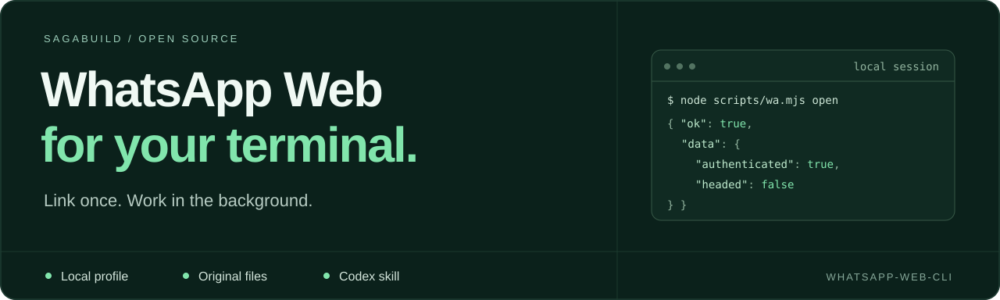
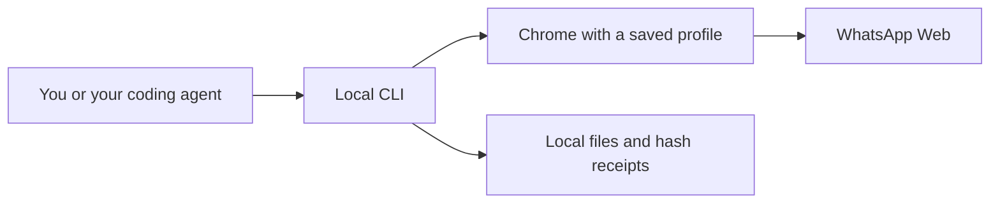

# WhatsApp Web CLI

[](https://github.com/SagaBuild/whatsapp-web-cli/actions/workflows/ci.yml)
[](LICENSE)
[](https://nodejs.org/)
[](https://github.com/SagaBuild/whatsapp-web-cli/releases/latest)

A local CLI and Codex skill for WhatsApp Web. Find chats, read loaded messages, extract links, download original attachments and prepare explicitly requested sends. Link your own account once; later runs reuse the same Chrome profile and run in the background without a desktop window.

[Get started](#get-started) · [Commands](references/commands.md) · [Mac setup](docs/macos.md) · [Privacy](docs/privacy.md) · [Contribute](CONTRIBUTING.md)

Unofficial UI automation. This project is not affiliated with WhatsApp, Meta, OpenAI or Microsoft. It uses the rendered web interface, not an unofficial WhatsApp protocol client.

## Get started

You need **Node.js 22+**, **Google Chrome**, WhatsApp on your phone, and a local desktop session. Install [Node.js](https://nodejs.org/) and [Chrome](https://www.google.com/chrome/) first. Codex is needed for the skill integration; the CLI also runs directly.

**On a Mac?** Use the same commands below. See the [macOS guide](docs/macos.md) for Apple Silicon/Intel requirements, Chrome locations and an account-free verification command.

Clone the repository, or [download the source ZIP](https://github.com/SagaBuild/whatsapp-web-cli/archive/refs/heads/main.zip) and open a terminal in its folder:

```sh
git clone https://github.com/SagaBuild/whatsapp-web-cli.git
cd whatsapp-web-cli
npm ci --ignore-scripts
npm run setup
```

If you downloaded the ZIP, skip the first two commands. No global npm installation or API key is needed.

Setup installs the skill, opens **web.whatsapp.com** in a dedicated Chrome profile, and waits for login:

1. On your phone, open WhatsApp → **Settings** (iPhone) or the **menu** (Android).
2. Choose **Linked devices → Link a device** and scan the QR code in Chrome.
3. Keep **Stay logged in** enabled if WhatsApp shows that option. Wait for the terminal to say **Ready**.
4. Run `node scripts/wa.mjs close` to close the login window. Normal CLI use starts Chrome in the background and retains the login.

Then ask Codex:

> Use $whatsapp-web to find my Project team chat and list its recent attachments. Do not send anything.

No API key or WhatsApp Business account is required. You never share your QR code, login code or browser profile with this project's maintainers. Setup does not select chats, read messages or send anything.

**Already linked?** Setup detects the saved login and finishes without requesting another scan. Closing Chrome or updating the skill keeps the profile. WhatsApp can revoke a linked device; see [login and recovery](docs/onboarding.md). Phone-linking instructions follow [WhatsApp's official guidance](https://www.youtube.com/watch?v=2PzIAa3M8rM).

## What it does

| Task | Command |
| --- | --- |
| Open the saved profile in the background | `open` |
| Open a desktop window for manual inspection | `open --headed` (after `close`) |
| Find and select a chat | `chats --query TEXT`, then `chat --name EXACT_TITLE` |
| Read loaded history and full URLs | `messages --chat TITLE`, `links --chat TITLE` |
| Save original files/photos with hash receipts | `download --chat TITLE --message ID --out DIRECTORY` |
| Prepare text or documents | `compose --chat TITLE --text-file FILE`, `upload --chat TITLE --file FILE` |
| Send an unchanged, authorized draft | `send --chat TITLE --authorized` |
| Check an uncertain send without retrying | `send-check --chat TITLE` |
| Other web UI operations | `ui snapshot`, `ui click`, `ui fill`, `ui upload`, … |

Prefix commands with `node scripts/wa.mjs` from this checkout. Setup prints the absolute installed CLI path for use from other projects. Commands return JSON; failures use a nonzero exit status. See the [command guide](references/commands.md) for examples and recovery.

Chrome still runs locally in headless mode; it simply has no visible desktop window. Reads, downloads, uploads and UI commands use the same browser interface. `open` reuses an existing session without restarting it. To change visibility, finish any pending attachment preview, run `close`, then `open` or `open --headed`. Both modes retain the same account profile. See [background mode and login](docs/onboarding.md).

Sending requires the user's actual instruction. `--authorized` records that instruction; it does not grant permission by itself. General UI clicks and key presses can also send. Downloads never overwrite existing payload files; repeated downloads recheck their hashes.

## Login and privacy



Each user links a separate local profile. This repository contains no linked account and does not operate a login or message relay service. Private runtime files and selected upload copies stay in the user's application-data directory, outside the checkout by default.

WhatsApp and Chrome still use the network. Messages returned to Codex or another agent enter its context and are subject to its data settings. Local browser storage does **not** mean local-only AI processing. Read [what is stored and shared](docs/privacy.md).

## Support and limits

The synthetic suite runs on Node 22 and 24 across Windows, Ubuntu, Apple Silicon Macs and Intel Macs. See the [current CI results](https://github.com/SagaBuild/whatsapp-web-cli/actions/workflows/ci.yml) for each platform. macOS targets 14+; Windows is also validated against a linked account. CI uses synthetic data and never links a real WhatsApp account. Run `npm run verify` for a shareable summary on your machine. A graphical desktop and Chrome are required for phone linking.

History results remain partial. Grouped albums, unavailable media, other interface languages and WhatsApp UI changes can require manual inspection. An outgoing bubble is not proof of server delivery. Unresolved sends block new preparation until checked or deliberately resolved after UI/history inspection.

## Development

```sh
npm ci --ignore-scripts
npm run verify
```

`npm test` shows individual checks; `npm run release:check` checks the public file inventory. Tests exercise complete CLI workflows, exact file bytes, interrupted upload recovery, persistent browser state, installation and release rejection. See the [testing guide](docs/testing.md) for evidence boundaries and contribution expectations.

Use the [bug report](https://github.com/SagaBuild/whatsapp-web-cli/issues/new?template=bug_report.yml) or [feature request](https://github.com/SagaBuild/whatsapp-web-cli/issues/new?template=feature_request.yml) forms. Contributions and synthetic reproductions are welcome. Read [CONTRIBUTING.md](CONTRIBUTING.md) and [SECURITY.md](SECURITY.md) before sharing diagnostics.

## License and credits

[MIT](LICENSE). Uses Microsoft's [Playwright CLI](https://github.com/microsoft/playwright-cli), pinned to a tested version; dependencies retain their own [licenses and notices](THIRD_PARTY_NOTICES.md). Inspired by [CLI-Anything](https://github.com/HKUDS/CLI-Anything); CLI-Anything is not a runtime dependency.
